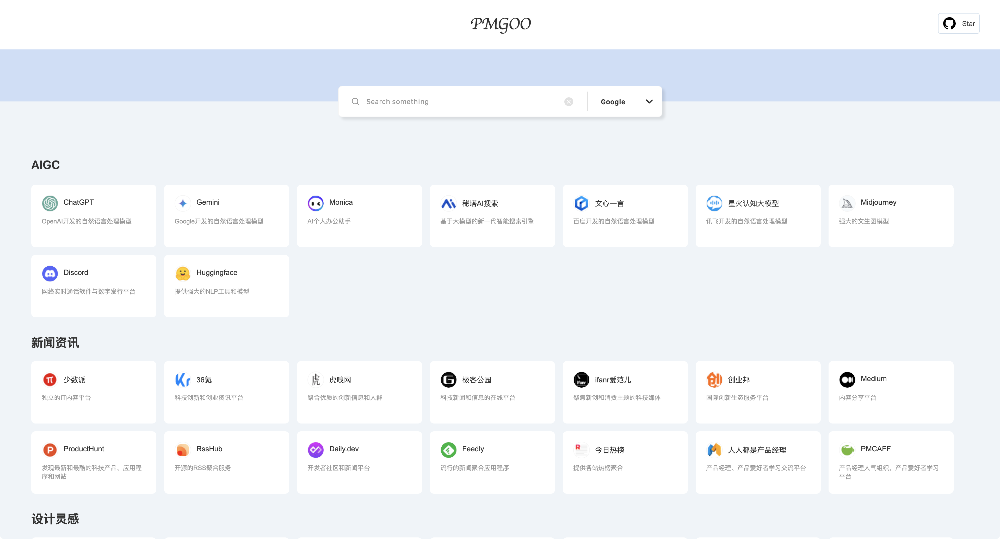
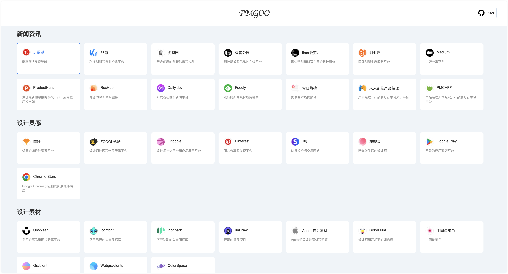
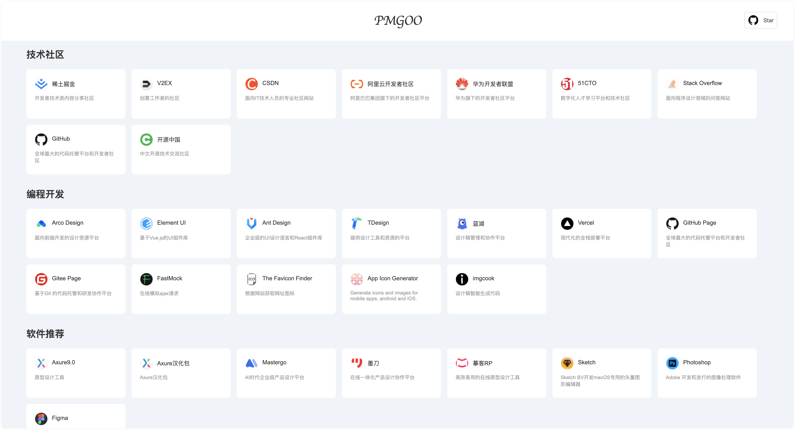
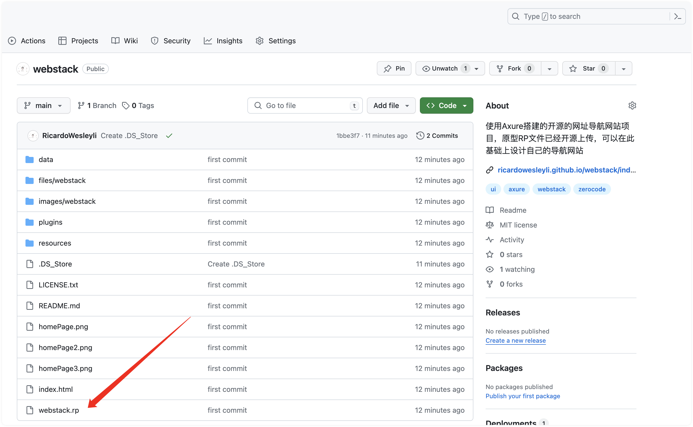
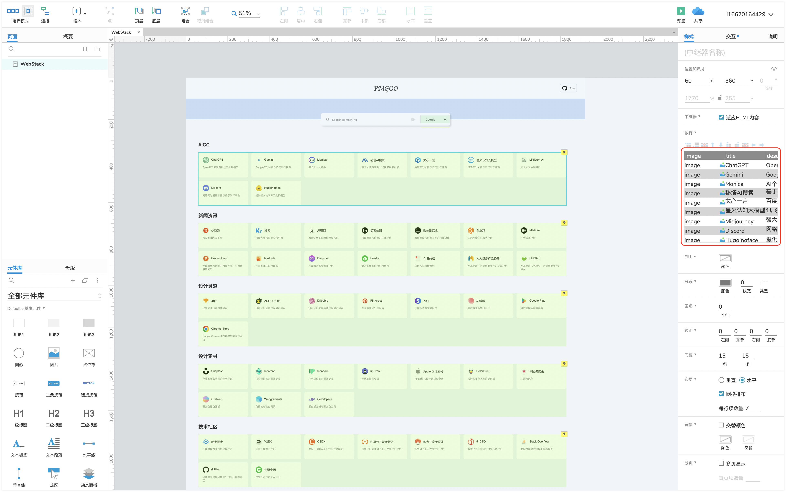

# webstack

###### 项目简介：使用Axure原型设计软件制作的导航网站，实现功能包括搜索、导航卡片展示、点击卡片跳转等等。纯静态网站项目，用来搭建导航网站刚刚好。

##### 项目预览1

###### 1.可以直接将导航网站固定到浏览器，方便快速使用。
###### 2.该导航网站的搜索引擎可以直接使用哦，整合了很多搜索方式。



##### 项目预览2

###### 3.鼠标移入移出添加了交互效果，增加交互性。
###### 4.点击卡片，可以直接跳转到该网址。



##### 项目预览3

###### 5.目前只整合了部份内容，都是我平时经常逛的网址。
###### 6.你也可以修改代码，或者修改项目提供的原型设计文件，然后通过导出HTML的方式构建导航网站。



## 项目下载

###### 可以使用GitHub Desktop下载项目，或者使用git下载项目，或者简单的可以直接下载zip文件然后解压项目使用。

克隆代码：

```shell
git clone https://github.com/RicardoWesleyli/webstack.git
```

## 原型修改

###### 原型文件是下面这个文件。



## 修改数据

###### .rp文件需要Axure9.0版本及以上的软件打开，打开文件后，可以直接修改中继器中的数据，来添加或者删除导航卡片。



## 重新部署

###### 使用Axure“分享”功能，导出本地HTML文件，然后重新上传到github，使用github page来创建可访问的静态网站即可。

###### 如果不了解这一步，下次我再专门分享这个步骤，或者你可以在网上查一查。

## License

MIT
